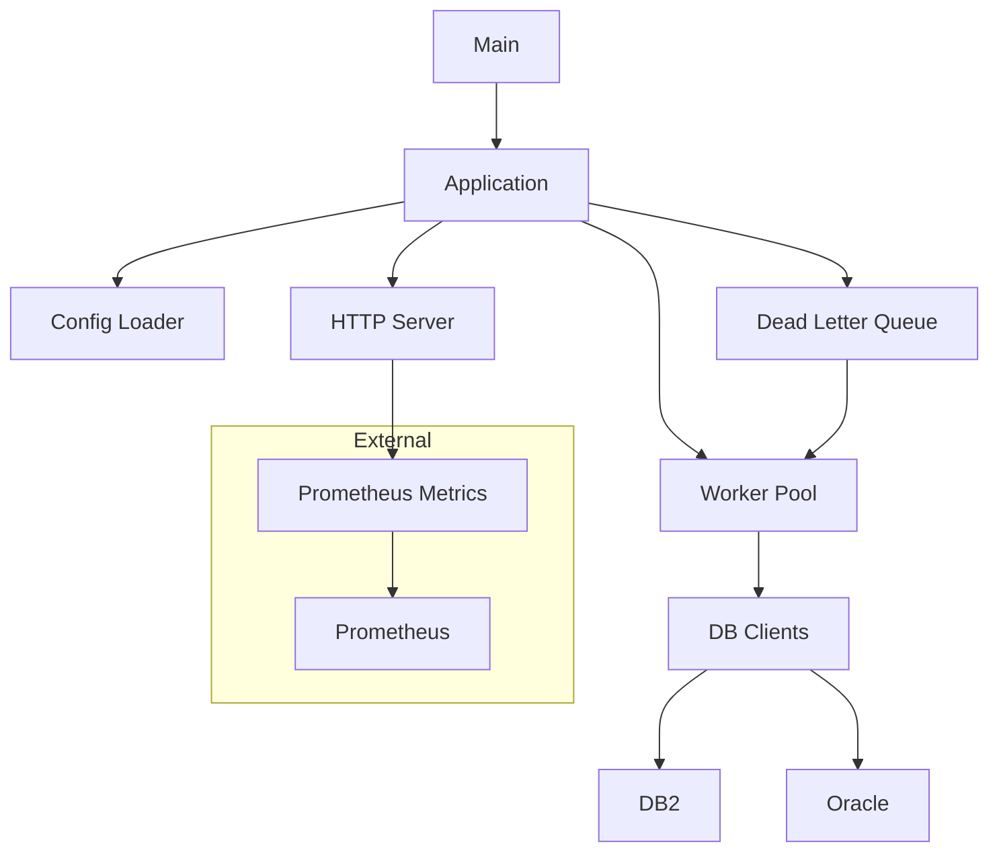

# Architecture

This document describes the architecture of the promDB2ORA application.

## Overview
The application is a Go-based service that monitors DB2 and Oracle databases, exposing metrics to Prometheus. It uses a modular design with concurrent workers and fault-tolerance features.

## Components
- **Main**: Entry point (`cmd/main.go`) initializing the app and Prometheus metrics.
- **App**: Core logic (`internal/app/`) managing config, workers, and HTTP server.
- **DB Client**: Database interactions (`internal/db/`) with TLS support.
- **Utils**: Helper functions (`internal/utils/`) for encryption, logging, etc.
- **Dead Letter Queue**: Retries failed queries (`internal/app/deadletter.go`).

## Diagram

![Diagram] (mermaidjs.png)

- Config Loader: Reads and watches config.yml.
- Worker Pool: Executes queries concurrently.
- HTTP Server: Serves /metrics and /health.
- DB Clients: Connect to DB2/Oracle with TLS.
- Dead Letter Queue: Retries failed queries.

Data Flow

- Config is loaded and queries are scheduled.
- Workers execute queries against DBs.
- Results are exposed as Prometheus metrics.
- Failed queries go to DLQ for retry.

Fault Tolerance

- Circuit breakers prevent overload.
- DLQ ensures failed queries are retried.
- Graceful shutdown preserves state.